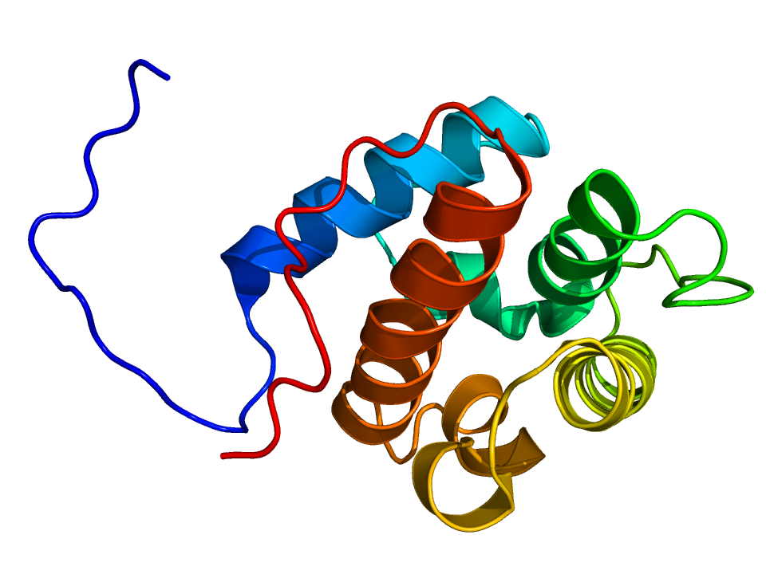

# Calponin
## clone CALP
 
Calponin expression is restricted to smooth muscle cells and has been shown to be a marker of the differentiated (contractile) phenotype of developing smooth muscle.

The staining pattern for anti-calponin is cytoplasmic.

## Normal Cells 
In immunohistochemical (IHC) studies on cryostat sections of human fetal tissue, monoclonal anti-calponin, CALP, was found to stain developing visceral smooth muscle of trachea, jejenum, esophagus and uterus in 10 and 20 week-old fetuses. Monoclonal anti-calponin did not react positively with 10 and 20 week-old fetal aortic smooth muscle cells. 
Monoclonal antibody CALP was found to localize calponin in cryostat sections of adult visceral and vascular smooth muscle but not in epithelial cells, endothelial cells, or connective tissue fibroblasts. 
Adult aortic cells of the tunica media and a portion of subendothelial intimal cells were found to stain positively.In cryostat sections and routinely fixed specimens of normal human breast, calponin expression has been demonstrated in smooth muscle cells of blood vessels and myoepithelial cells in the lobules, ducts and galactophorous sinuses. Periacinar and periductal myoepithelial cells of the salivary gland have also been shown to react positively with anti-calponin, whereas ductal epithelial cells were negative. 

## Tumor Cells 
Calponin expression has been demonstrated by IHC in myoepithelial cells in benign and malignant breast lesions. Myoepithelial cells in papillomas of the breast were found to stain positively with anti-calponin but no reactivity was observed in intracystic papillary carcinomas. In ductal carcinoma in situ, calponin immuno-reactivity has been demonstrated in myoepithelial cells at the periphery of involved ducts and lobules in complex sclerosing lesions of the breast.
Anti-calponin was shown to label stromal myofibroblasts in the majority of invasive breast carcinomas tested but was unreactive with tumor cells. Reactivity has also been observed in neoplastic myoepithelium of routinely fixed pleomorphic adenomas of the salivary gland.

## Images

